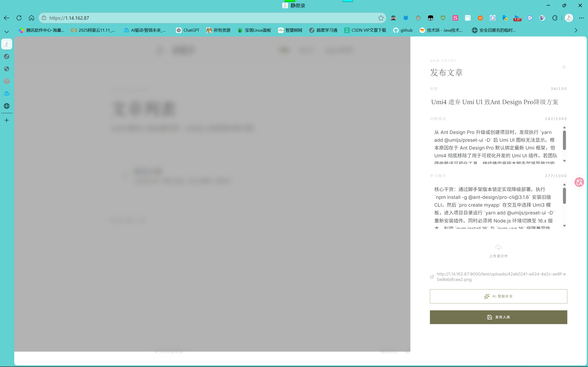
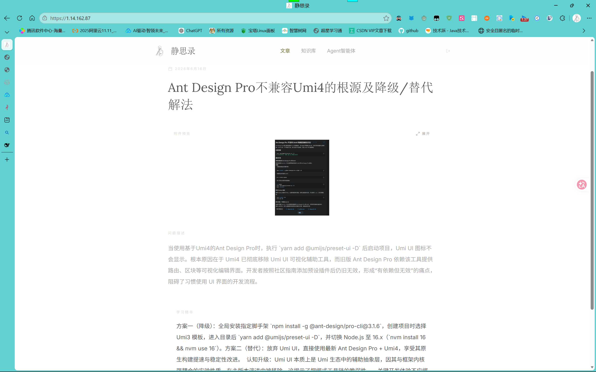
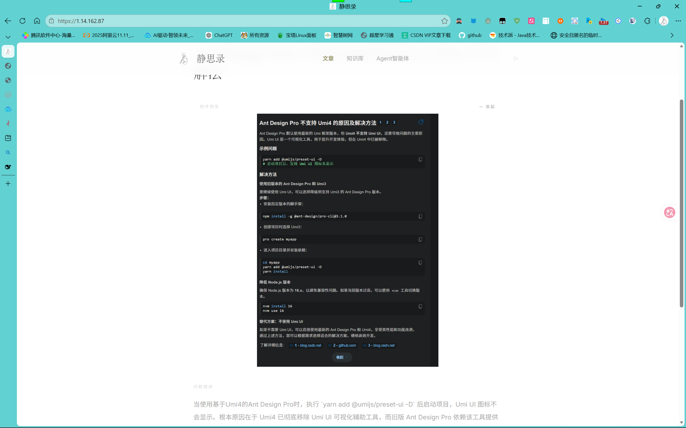
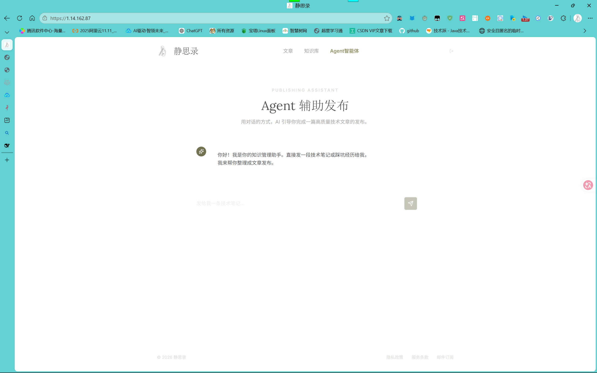

<div align="center">


# 静思录 · AI 驱动的博客知识管理平台

<p>
  
  
  
  
  
  
  
</p>

> 🎓 **一名大二学生独立完成的个人项目** —— 写作 × AI × 知识沉淀，让每一次技术踩坑都变成可检索的经验资产

🌐 **线上原型已部署**：**[http://1.14.162.87](http://1.14.162.87)** 欢迎访问体验！

<div align="center">

`Spring Boot 3` `Spring AI` `DeepSeek` `React 19` `Tailwind CSS` `Agent` `AI Blog` `Knowledge Base` `ElasticSearch` `Kafka` `Minio` `MyBatis Plus` `Function Calling` `智能博客` `知识库` `AI写作` `大模型` `全栈` `Java` `TypeScript` `大学生项目` `个人博客` `经验管理` `Agent发布`

</div>

</div>

---

## ✨ 为什么做这个项目？

程序员每天都在解决问题，但这些宝贵的经验往往散落在脑子里、聊天记录里、临时笔记里，**用的时候找不到，不用的时候想不起来**。

静思录解决了这个问题：**上传你的笔记 / 截图 / PDF → AI 自动提炼标题、问题描述、经验总结 → 存入知识库并自动打分排序 → 相似经验自动去重**。

更有一个 **Agent 智能体**，通过对话式引导帮你把零散的想法变成高质量的技术文章。

---

## 🧩 核心功能

### 📝 文章管理
- 文章增删改查，支持分页列表展示
- **多格式文件上传解析**：PNG、HTML、Markdown、PDF 等
- **AI 自动补全**：上传文件后，调用 DeepSeek 大模型自动生成标题、问题描述、经验总结

### 🧠 经验知识库
- AI 对所有经验自动 **归类、打分**（价值评分）
- 按 **打开频率 + AI 评分** 智能排序
- **ElasticSearch 全文搜索**，快速检索经验
- **相似度去重**：相似度过高的经验自动拦截，不进入知识库
- Kafka 异步处理经验入库，保证系统响应速度

### 🤖 Agent 智能体发布
- 对话式交互，Agent 引导你系统性描述问题
- 从对话中自动提炼结构化信息
- 一键生成高质量技术文章
- Function Calling 能力（管理端 & 用户端双工具集）

---

## 🏗️ 技术架构

```
┌──────────────────────┐      ┌──────────────────────────────────┐
│   Frontend           │      │          Backend                 │
│   Vite + React 19    │◄────►│   Spring Boot 3.5               │
│   Tailwind CSS 4     │      │   Spring AI (DeepSeek)          │
│   TypeScript         │      │   MyBatis Plus                  │
│   Motion (动画)       │      │   Knife4j (API 文档)            │
└──────────────────────┘      │                                  │
                              │  ┌──────────┐  ┌──────────────┐ │
                              │  │  MySQL   │  │ ElasticSearch│ │
                              │  └──────────┘  └──────────────┘ │
                              │  ┌──────────┐  ┌──────────────┐ │
                              │  │  Kafka   │  │    Minio     │ │
                              │  └──────────┘  └──────────────┘ │
                              └──────────────────────────────────┘
```

| 层级 | 技术 | 说明 |
|------|------|------|
| **前端** | React 19 + Vite + Tailwind CSS 4 | 响应式设计，日式自然色系 |
| **后端** | Spring Boot 3.5 + Java 17 | RESTful API，全局异常处理 |
| **AI** | Spring AI + DeepSeek V4 | 文章自动补全 + Agent Function Calling |
| **数据库** | MySQL 8.0 + MyBatis Plus | 文章、知识库、会话持久化存储 |
| **搜索引擎** | ElasticSearch | 知识库全文检索 |
| **消息队列** | Kafka | 异步经验提取入库 |
| **对象存储** | Minio | 上传文件存储 |
| **OCR** | Tess4J 5.11（内置 Tesseract 5.3.4） | 图片文字识别，DLL 已打包无需额外安装 |
| **PDF 解析** | PDFBox 3.0 | PDF 文件内容提取 |
| **认证** | JJWT | JWT 令牌管理 |
| **文档** | Knife4j 4.4 | 自动生成 API 文档 |

---

## 🔥 项目亮点

- 🧠 **AI 驱动全流程** — Spring AI + DeepSeek + Agent Function Calling，AI 贯穿文章撰写、经验提取、知识沉淀全链路
- 🔍 **ElasticSearch 全文检索** — 毫秒级搜索你的技术经验和文章
- 📡 **Kafka 异步消息** — 高并发场景下保证流畅体验，经验异步入库不阻塞主流程
- 🤖 **Agent 智能体** — 对话式引导发布，让 AI 帮你写出高质量技术博客
- 🚀 **一键启动** — 首次启动自动建表建索引，无需手动导入 SQL

---

## 🚀 快速开始

### 环境要求

- **JDK 17+**
- **Node.js 18+**
- **MySQL 8.0+**
- **ElasticSearch 7.x+**（默认 `localhost:9200`）
- **Kafka 3.x+**（默认 `localhost:9092`）
- **Minio**（可选，默认 `localhost:9000`，账号密码 `minioadmin/minioadmin`）
- **Tesseract OCR**：**无需单独安装** — Tess4J 5.11 已内置 Tesseract 5.3.4 的 Windows DLL（32 位和 64 位均包含），中文/英文训练数据已放在 `BlogBacked/tessdata/` 目录下

### 1. 克隆项目

```bash
git clone https://github.com/xiabiqing/ai-knowledge-blog.git
cd ai-knowledge-blog
```

### 2. 启动后端

```bash
cd BlogBacked

# 只需配好环境变量，其他都自动搞定
export MYSQL_USERNAME=root
export MYSQL_PASSWORD=your_password
export DEEPSEEK_API_KEY=sk-your-deepseek-api-key

# 启动 — 首次运行自动建表 + 建 ES 索引，无需手动导入 SQL！
./mvnw spring-boot:run
```

> ⚡ **首次启动提示**：`ProjectInitRunner` 会自动执行 MySQL 建表语句和 ElasticSearch 索引创建，你只需要确保 MySQL 和 ES 服务在运行即可，完全零手工。

后端启动后访问：
- API 服务：http://localhost:8080
- Knife4j 文档：http://localhost:8080/doc.html

### 3. 启动前端

```bash
cd BlogFronted

# 安装依赖
npm install

# 启动开发服务器
npm run dev
```

浏览器打开 http://localhost:3000

> 💡 **Tip**：连续点击左上角 Logo 3 次可唤出管理员登录面板。

### 4. 环境变量

| 变量 | 说明 | 默认值 |
|------|------|--------|
| `MYSQL_USERNAME` | MySQL 用户名 | `root` |
| `MYSQL_PASSWORD` | MySQL 密码 | - |
| `DEEPSEEK_API_KEY` | DeepSeek API Key（后端 AI） | - |
| `GEMINI_API_KEY` | Gemini API Key（前端可选） | - |

**Minio 配置**（在 `application.yml` 中，一般无需修改）：
| 配置项 | 默认值 | 说明 |
|--------|--------|------|
| `minio.endpoint` | `localhost` | Minio 服务地址 |
| `minio.port` | `9000` | Minio API 端口 |
| `minio.access-key` | `minioadmin` | Minio 访问密钥 |
| `minio.secret-key` | `minioadmin` | Minio 密钥 |

### 5. Maven 配置

项目依赖 `Spring AI` 里程碑版本，已在 `pom.xml` 中配置 Spring Milestones 仓库，无需额外配置。国内用户如 Maven 下载慢，可在 `~/.m2/settings.xml` 中配置阿里云镜像。


---

## 📸 功能预览

### 文章列表



### 文章详情

| 缩略版 | 放大版 |
|--------|--------|
|  |  |

### 知识库 & Agent 智能体

| 知识库 | Agent 智能体 |
|--------|-------------|
|  |  |

---

## 📂 项目结构

```
Blog/
├── BlogBacked/                 # Spring Boot 后端
│   ├── src/main/java/fun/xiabiqing/
│   │   ├── controller/         # REST 控制器
│   │   ├── service/            # 业务逻辑层
│   │   ├── mapper/             # MyBatis 数据访问
│   │   ├── entity/             # PO/DTO/VO 实体
│   │   ├── config/             # Spring 配置
│   │   ├── constant/           # 常量定义
│   │   ├── kafka/              # Kafka 消费者
│   │   ├── interceptor/        # 登录拦截器
│   │   ├── utils/              # 工具类（AI Agent）
│   │   └── sql/                # 数据库初始化脚本
│   └── pom.xml                 # Maven 依赖
│
├── BlogFronted/                # React 前端
│   ├── src/
│   │   ├── pages/              # 页面组件
│   │   │   ├── Articles.tsx    # 文章列表页
│   │   │   ├── KnowledgeBase.tsx # 知识库页
│   │   │   └── AgentPublish.tsx  # Agent 智能发布页
│   │   ├── components/         # 通用组件
│   │   ├── contexts/           # React Context (Auth)
│   │   └── api.ts              # API 请求封装
│   ├── package.json
│   └── vite.config.ts
│
└── README.md
```

---

## 🤝 贡献

欢迎提 Issue 和 PR！如果你觉得这个项目有用，请点个 ⭐ Star。

## 📄 License

MIT © [xiabiqing](https://github.com/xiabiqing)

---

<div align="center">
  <sub>👨‍💻 一名大二学生用 Java + React 独立开发 · Powered by DeepSeek & Spring AI</sub>
</div>
